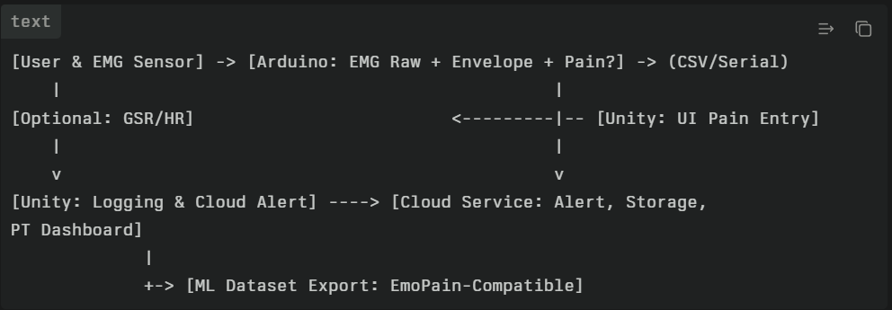

# HatchWell, Sensor Driven MR Rehab for Rotator Cuff Repair

HatchWell is a sensor driven physical therapy system for arthroscopic rotator cuff repair recovery. Using Meta Quest 3, Arduino EMG biosensors, and a mobile or web companion app, HatchWell turns painful PT into an engaging, trackable, and rewarding experience.

## About

Clinical focus, outpatient post op PT for arthroscopic rotator cuff repair.  
Platform, Meta Quest 3 with hand tracking and mixed reality and XR Interaction Toolkit.  
Sensors, Arduino EMG for fatigue and pain related muscle signals.  
Companion app, built with Lovable for web and mobile.  
Design flows, Figma links below.

## Features

1. MR exercise tracking with hand reps and accuracy.  
2. Real time fatigue and pain bar from biosensor data.  
3. Companion app for patients and therapists.  
4. Progress logs, motivational feedback, and goal celebrations.

## Demo materials

1. APK build in the build folder, download from this link, [build, HatchWell_MR_Quest.apk](build/HatchWell_MR_Quest.apk).  
2. System diagram image is included below.  
3. Wireframes and companion app links are listed in Tech stack.

## Tech stack

Unity with XR Interaction Toolkit and Meta Quest SDK.  
APK build is in the build folder, it is downloadable from GitHub through Git LFS.

Arduino with EMG biosensor kit.  
Live demo and system diagram,  

Lovable for the cross platform mobile or web app.  
Lovable project link, https,,//lovable.dev/projects/6455b4d4-20d6-417c-b9d0-32c6dc611b08

Figma for wireframes, research, and the design system.  
Research board, https,,//www.figma.com/board/ilJ2kQMeNRHKwFYt1crhWn/Hack-IX-Team-1?node-id=0-1&t=RklfEvZhrtEHSRUd-1  
Front end design, https,,//www.figma.com/design/279zoUNPdgNqEEVUqrYDgy/Hack-IX-Team-1-Front-End-design?node-id=122-1311

## How to run

1. Install the MR app, sideload the APK from the build folder onto Meta Quest 3.  
2. Optional, flash the Arduino sketch and connect for live fatigue or pain signals.  
3. Open the Lovable app link for the mobile or web companion.  
4. Review wireframes through the Figma links.

## AI disclaimer

We used AI tools for research, coding, and design support, Perplexity, Claude, ChatGPT.  
We used design and build tools, Figma, Lovable, Replit.

## License

Distributed under the MIT License. See LICENSE for details.